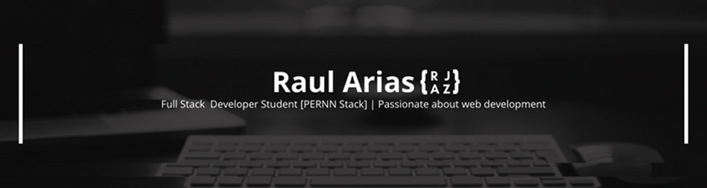

### Hi There 👋
My name is Raúl Arias, I'm a Full Stack Developer student, passionate about web programming and technology. Currently I've solid knowledge as a frontend developer... I'm constantly studying, learning and experimenting with technologies and tools to find the best solutions to the problems at hand.

#
 

  

- 🔭 I’m currently working as a Freelancer.
- 🌱 I’m currently learning the PERNN Stack.
- 👯 I’m looking to collaborate on new open-source projects.
- 🎓 I’m looking for a Mentor (Senior Dev)

#

## Goals in progress 👨‍💻
 - 📈 Improve my skills in JS.
 - 📈 Learn React and Nodejs in depth.
 

<h2 align="center">⚙ Languages and Tools</h2>

<b>🎨 Frontend</b>

 

<b>💻 Tools</b>

 

&nbsp;
&nbsp;
&nbsp;
&nbsp;
&nbsp;
&nbsp;
&nbsp;
&nbsp;
&nbsp;
&nbsp;

 

<h2 align="center">📩 Connect with me</h2>

&nbsp;

<!--
**rauljariasz/rauljariasz** is a ✨ _special_ ✨ repository because its `README.md` (this file) appears on your GitHub profile.

Here are some ideas to get you started:

- 🔭 I’m currently working on ...
- 🌱 I’m currently learning ...
- 👯 I’m looking to collaborate on ...
- 🤔 I’m looking for help with ...
- 💬 Ask me about ...
- 📫 How to reach me: ...
- 😄 Pronouns: ...
- ⚡ Fun fact: ...
-->
